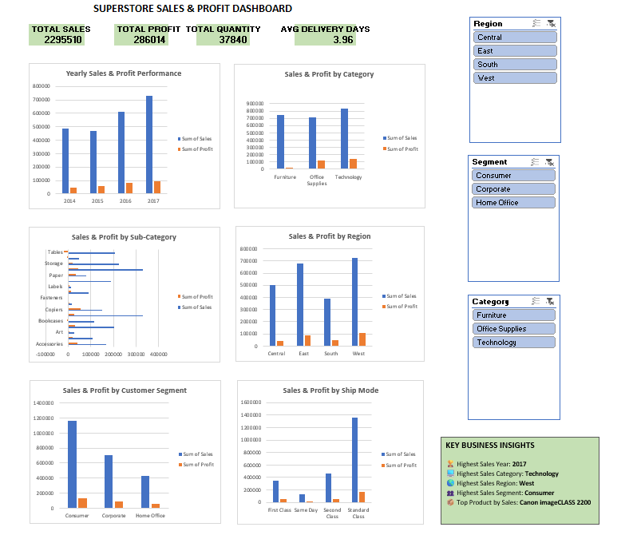

# Superstore Sales & Profit Analysis Dashboard

## 📊 Overview

An interactive Excel dashboard built to analyze Superstore sales and profit performance and identify key business trends.

## 📸 Dashboard Preview

## 🛠️ Tools Used

- Microsoft Excel
- PivotTables & PivotCharts
- Slicers
- Data Cleaning
- Data Visualization
- Business Analysis

## 📌 Key Features

- KPI dashboard for Sales, Profit, Quantity & Delivery Days
- Yearly Sales & Profit analysis
- Category, Sub-Category & Regional analysis
- Customer Segment & Ship Mode analysis
- Top 10 Products by Sales
- Interactive Region, Category & Segment slicers
- Key Business Insights

## 💡 Key Insights

- Highest Sales Year: **2017**
- Highest Sales Category: **Technology**
- Highest Sales Region: **West**
- Highest Sales Segment: **Consumer**

## 📁 Project File

[Download Excel Dashboard](./Superstore_Sales_Analysis_Dashboard.xlsx)

## 🎯 Skills Demonstrated

**Excel | Data Analysis | Data Visualization | Dashboard Development | Business Insights**
